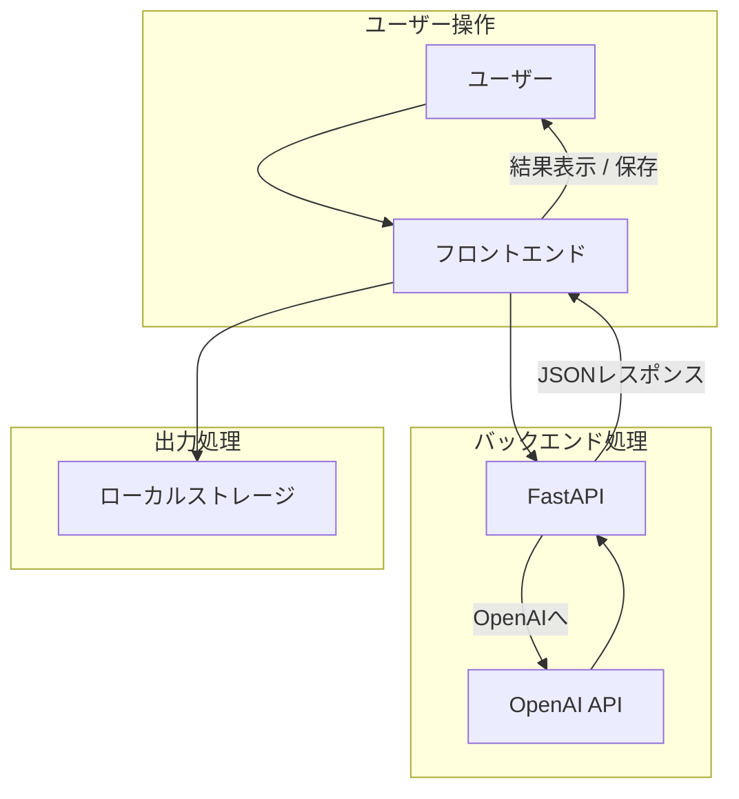

# データフロー図（DFD） - PromptGrade

## 📌 目的

このドキュメントは、プロンプト評価アプリ「PromptGrade」における**データの流れ**を視覚的に整理し、各処理の接続関係を理解するための資料です。

---

## 🧭 DFD レベル 0（全体図）

```mermaid
flowchart TD
    User[ユーザー] -->|プロンプト入力| FrontEnd[フロントエンド<br>(HTML/JS)]
    FrontEnd -->|POST /evaluate| FastAPI[FastAPI APIサーバー]
    FastAPI -->|API呼び出し| OpenAIAPI[OpenAI API]
    OpenAIAPI -->|評価結果の返却| FastAPI
    FastAPI -->|JSONで返却| FrontEnd
    FrontEnd -->|結果を表示| User
```

---

## 🔁 処理詳細ステップ

### 1. ユーザーの入力

- プロンプト入力フォームに文字列を入力
- イベント発火で `/evaluate` に POST 送信

---

### 2. FastAPI での受信

- `POST /evaluate` にて JSON データを受信
- `prompt` を抽出し、OpenAI API に転送するためのメッセージ形式に整形

---

### 3. OpenAI API との連携

- `chat/completions` エンドポイントにプロンプトを渡す
- GPT モデル（gpt-4）から評価と改善案を受信

---

### 4. 結果の加工と返却

- OpenAI のレスポンスから `score` / `feedback` / `suggested_prompt` を抽出
- JSON 形式にしてフロントエンドに返却

---

### 5. フロントエンドでの表示

- 画面上にスコア・フィードバック・改善プロンプトを表示
- オプション：履歴としてローカルストレージに保存

---

## ✅ 今後の拡張を見越したデータフロー（DFD レベル 1）



---

## 🛠 補足

- ローカルストレージは将来的にデータベースに置き換え可能
- OpenAI API の出力構造変更に応じて解析部分も拡張可能
- 各ステップはログ出力可能にしてデバッグしやすく設計推奨
